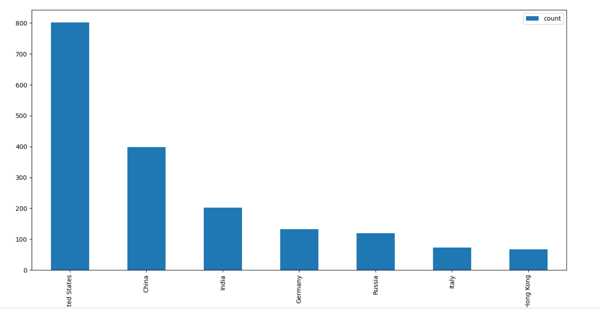
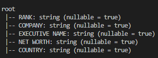
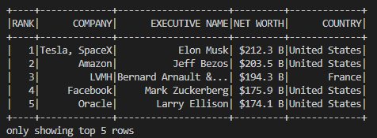
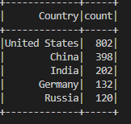
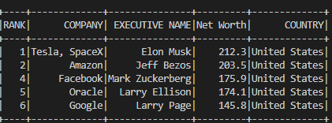

#  World Billionaire Data Analysis in PySpark
Python pyspark Spark matplotlib pandas

## Histogram for Top 7 countries with most billionaires

## Data Schema 

## Top 5 billionaires according to their net-worth

## Top 5 countries with most billionaires

## Top 5 billionaires from United States

## Purpose of the Project
The project was undertaken to do an exploratory data analysis on big data file in PySpark. The data is based on the top billionaires and was acquired from Kaggle. The exercise was done to get familiar with data analysis functions available in pyspark.

### Histogram for Top 7 countries with most billionaires
Created by sorting countries on the basis of their count of billionaires and selected the top 7 in descending order

## Data Schema 
Used printSchema function to explore data schema.
Net Worth was then converted to a float for easy analysis

## Top 5 billionaires according to their net-worth
Sorted the data by net worth in descending order and selected top 5 billiionaires

## Top 5 countries with most billionaires
Sorted countries on the basis of their count of billionaires and selected the top 5 in descending order

## Top 5 billionaires from United States
Filtered data on the basis of Country="United States" and selected top 5 billionairs in order of their net worth.
